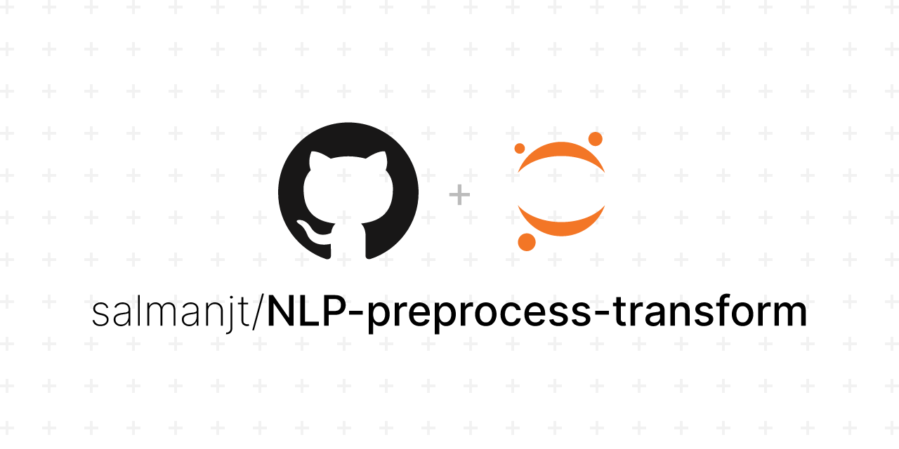

 

## Project Description

The primary objective is to preprocess a dataset of published papers and convert their textual content into numerical representations that are suitable for various Natural Language Processing (NLP) applications. NLP involves the interaction between computers and human language, enabling machines to understand, interpret, and generate human language text. Preprocessing and transforming raw textual data into numerical forms is a crucial step in preparing data for meaningful analysis and modeling in the NLP domain.

## Project Tree
```
📦 NLP-preprocess-transform
├─ LICENSE
├─ README.md
├─ data
│  ├─ input
│  │  ├─ papers.pdf
│  │  ├─ pdf_files
│  │  │  ├─ PP3206.pdf
│  │  │  ├─ PP3234.pdf
│  │  │  ├─ ...
│  │  │  └─ ...
│  │  └─ stopwords_en.txt
│  ├─ output
│  │  ├─ count_vectors.txt
│  │  ├─ summary_stats.csv
│  │  └─ vocab.txt
│  └─ sample
│     ├─ sample_count_vectors.txt
│     ├─ sample_stats.csv
│     └─ sample_vocab.txt
└─ notebooks
   └─ 01-preprocess-transform.ipynb
```

## Technologies Used

-   [Python](https://www.python.org/downloads/)
-   [Jupyter ](https://jupyter.org/)
-   [Google Drive API](https://developers.google.com/drive/api/v3/about-sdk)
-   [NLTK (Natural Language Toolkit)](https://www.nltk.org/)

## Why This Project Matters

Text preprocessing and feature transformation are fundamental steps in any Natural Language Processing (NLP) project. Proper preprocessing enhances the quality of data, making it more suitable for downstream NLP tasks such as sentiment analysis, topic modeling, text classification, and more. By transforming textual data into numerical representations, advanced machine learning algorithms can be applied to gain insights from unstructured text.

Overall, this project demonstrates a practical and comprehensive approach to handling various preprocessing tasks, from tokenization and stemming to feature extraction and statistical analysis.

## Further Improvements

-   **Custom Stopword List:** The project uses a pre-defined list of stopwords. Customizing the stopwords list based on the domain or context of the text data could improve the quality of preprocessing.
-   **Advanced Tokenization:** Investigating more advanced tokenization techniques, such as word embeddings or subword tokenization (e.g., Byte-Pair Encoding), might lead to better representations of words.
-   **Advanced Stemming:** Exploring more advanced stemming algorithms beyond Porter Stemmer, such as Snowball Stemmer, could yield improved results.
-   **Visualisation:** Incorporating data visualisations can help provide insights into the distribution of words, topics, and trends within the dataset.
-   **Deep Learning:** Exploring deep learning techniques like word embeddings (Word2Vec, GloVe) or pre-trained language models (BERT, GPT-3) could yield more advanced feature representations.

## License

This project is licensed under the MIT License - see the [LICENSE](https://github.com/salmanjt/NLP-preprocess-transform/blob/main/LICENSE) file for details.

## Credits

[Project Tree Generator](https://woochanleee.github.io/project-tree-generator)

